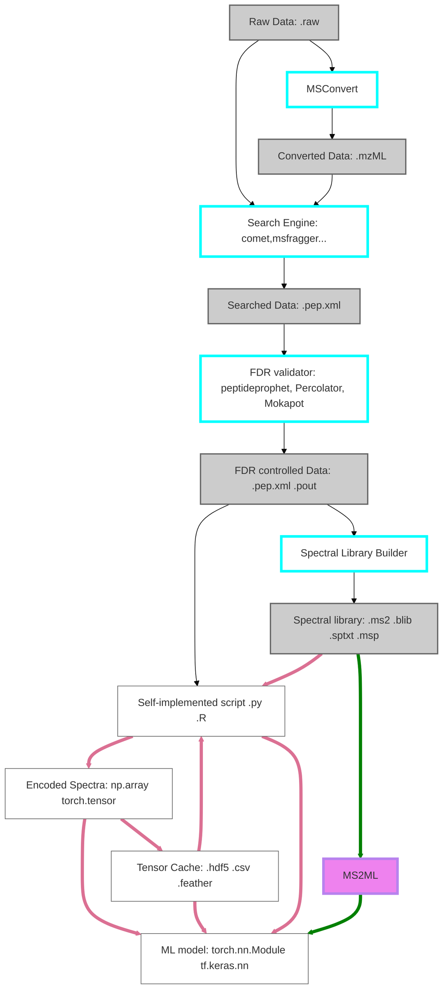

# ms2ml

Documentation site: https://jspaezp.github.io/ms2ml/main/

GitHub: https://github.com/jspaezp/ms2ml

**This package is in early development, I am actively taking ideas and requests**

The idea of this package is to have an intermeiate layer between the pyteomics package and ML applications.

Since ML applications do not take MS data as input directly, it is necessary to convert/encode it. This package is meant to handle that aspect.

This project is meant to be opinionated but not arbitrary. By that I mean that it should attempt to enforce the "better way" of doing things (not give flexibility to do everything every way) but all design decisions are open to discussion (ideally though github).

## Installation

```shell
pip install ms2ml
```

## Usage

```python
from ms2ml.config import Config
from ms2ml.data.adapters import MSPAdapter

# From proteometools
my_file = "FTMS_HCD_20_annotated_2019-11-12.msp"

def post_hook(spec):
    return {
        "aa": spec.precursor_peptide.aa_to_onehot(),
        "mods": spec.precursor_peptide.mod_to_vector(),
    }

my_adapter = MSPAdapter(file=my_file, config=Config(), out_hook=post_hook)
bundled = my_adapter.bundle(my_adapter.parse())
print({k: f"{type(v): of shape: {v.shape}}" for k, v in bundled.items()})
# {'aa': "<class 'numpy.ndarray'>: of shape: (N, 42, 29)",
#  'mods': "<class 'numpy.ndarray'>: of shape: (N, 42)"}
```

## Core parts

(subject to change...)

1. Parsers for external data are in ./ms2ml/data/parsing
    1. Parsers should only be able to read data and return a base python representation, dict/list etc.
1. Adapters are located in ./ms2ml/adapters, they should build on parsers (usually) but yield ms2ml representation objects (Spectrum, Peptide, AnnotatedSpectrum, LCMSSpectrum).
    1. Behavior can be modified/extended using hooks.
1. ms2ml representation objects have methods that converts them into tensor representations (Peptide.aa_to_onehot for instance)
1. As much configuration as possible should be stored in the config.Config class.
    1. It should contain information on the project and the way everything is getting encoded, so hypothetically one could just pass a config to a different data source adapter and get compatible results.
    1. What position of the onehot is alanine?
        1. look at the config
    1. WHat order are our ions encoded in?
        1. Look at the config.

## Core design

1. Unified configuration
    - All configuration should be explicit or immediately visible upon request
1. Consistent API
    - It should feel similar to process the data inernally regardless of the input.
1. Flexible output
    - Every research need is different, therefore requesting different data from the API should be straightforward.
1. Extensibility.
    - It should be easy to adapt workflows to new and unexpected input data types.
    - This is achieved with the addition of hooks that allow an additional slim layer of compatibility
1. Abstract the loops away
    - I do not like writting boilerplate code, neither should you. Ideally you will not need to write loops when using the user-facing API
    - Therefore I try my best to abstract all the `[f(spec) for spec in file]` within reason.
1. Fail loudly
    - It is already hard to debug ML models, lets make it easier by having **sensical** error messages and checks. They should also contain suggestions to fix the bug. Explicit is better than implicit. Errors are better than bugs.
1. Api documentation.
    - Documentation is critical, if it is not documented, It will be deleted (because nobody will use it ...)
    - Within reason, all external api should be documented, typed, in-code commented, have a docstring, check that it renders well using mkdocs and an example.
    - All classes should have a static `_sample` static method that gives a sample of that object, and its docstring shoudl include an example on how to generate it.

## Target audience

People who want to train ML models from peptide/proteomics data instead of figuring out ways to encode their tensors and write parsers.



## Peptide sequence notation

When possible I will attempt to allow 'Proforma' based sequence annotations.

Check:

- https://pyteomics.readthedocs.io/en/latest/api/proforma.html
- http://psidev.info/sites/default/files/2020-12/ProForma_v2_draft12_0.pdf
- https://www.psidev.info/proforma

# TODO

- [ ] Config
    - [ ] Handle variable modifications
- [ ] *Documentation, Documentation, Documentation*
    - [ ] Helper Annotation classes

# Similar projects:

- https://matchms.readthedocs.io/en/latest/:
    - Matchms is an open-access Python package to import, process, clean,
      and compare mass spectrometry data (MS/MS). It allows to implement
      and run an easy-to-follow, easy-to-reproduce workflow from raw mass
      spectra to pre- and post-processed spectral data.
    - Tailored for small molecule data

- https://gitlab.com/roettgerlab/ms2ai:
    - MS2AI from Tobias Rehfeldt (who is also part of the ProteomicsML project)
    - Uses maxquant to for a full PRIDE to ml workflow.

- https://github.com/wilhelm-lab/dlomix
    - DLOmix from Mathias Wilhelm’s group
    - Tensorflow centric implementatino of ml models for proteomcs

- https://github.com/wfondrie/depthcharge
    - Depthcharge is a deep learning toolkit for building state-of-the-art
      models to analyze mass spectra generated from peptides other and molecules.
    - It seems to focus on the model generation, rather than proving flexibility
      in encoding.

- https://github.com/bittremieux/spectrum_utils
    - spectrum_utils is a Python package for efficient mass spectrometry
      data processing and visualization.
    - Many of the spectrum processing aspects are similar but there
      is no focus in parsing or exporting encoding.

# Contribution

Right not this is a proof of concept package, I would be happy to make it something more stable if there is interest.
Feel free to open an issue and we can discuss what you need out of it!! (and decide who can implement it)
